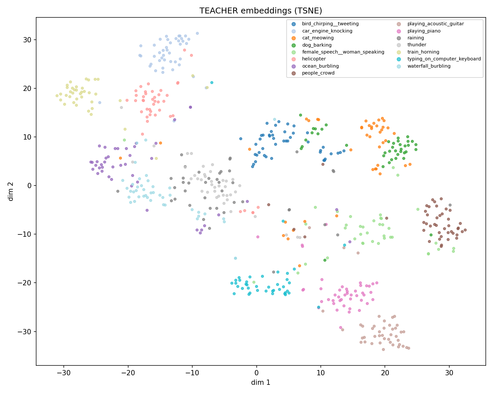
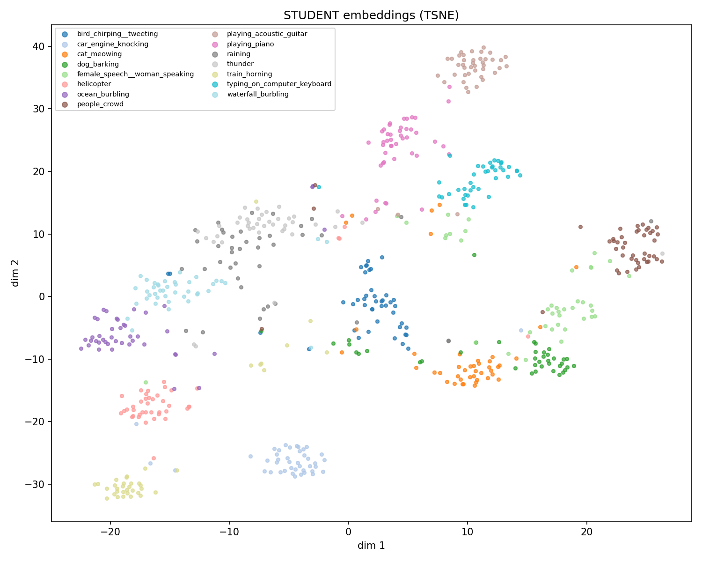
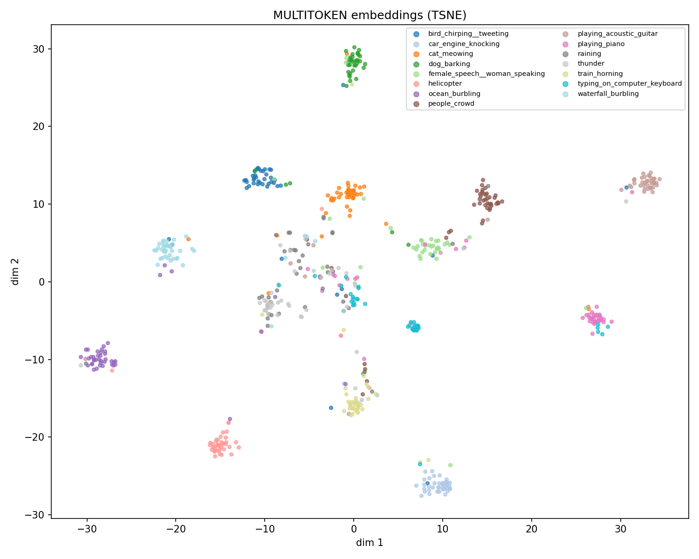
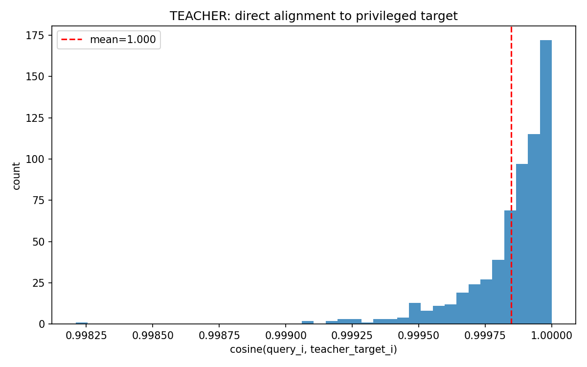
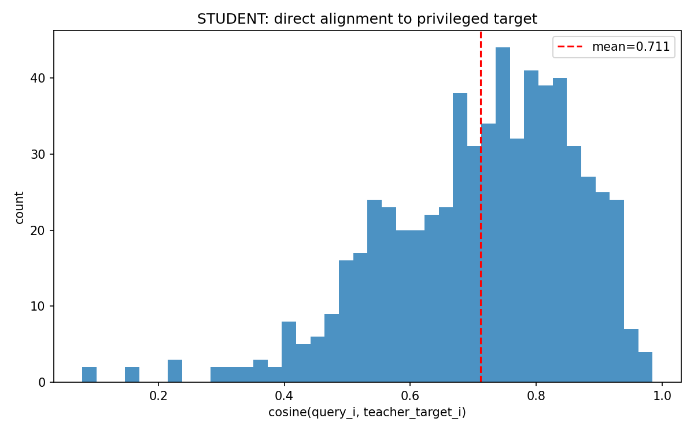
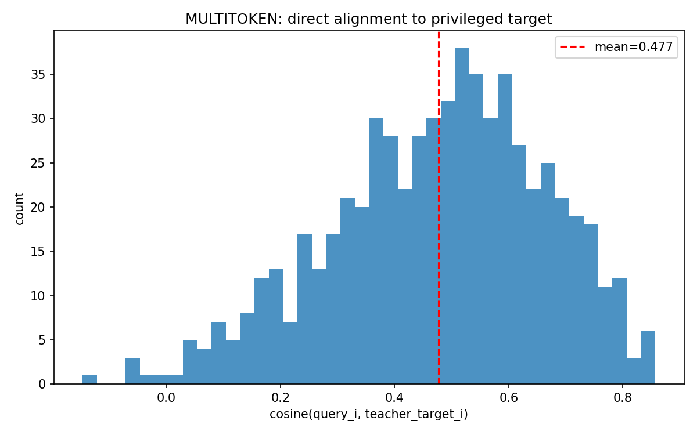
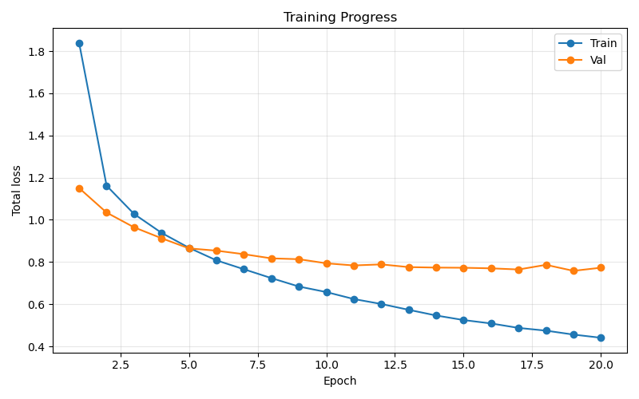
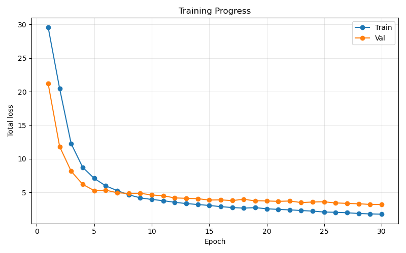

# Audio-Visual Approximation of Video Semantic Space

**AIMS DTU Research Intern 2026**

A technical report on distilling a frozen ImageBind teacher into cheaper student
models, and on how the resulting embedding spaces behave under retrieval,
clustering, alignment, and downstream classification.

---

## 1. Task objective

The goal is **privileged knowledge distillation**: reproduce a frozen, expensive
teacher's joint audio-visual embedding using a small trainable head on top of
cheaper frozen encoders, while preserving the *semantic* structure of the teacher
space.

The teacher is **ImageBind-huge**. For each VGGSound clip it produces a 2048-d
target

$$t = [\bar{v} \Vert a] \in \mathbb{R}^{2048}, \qquad \bar{v} = \frac{1}{5}\sum_{f=1}^{5} \text{ImageBind}_{\text{vis}}(\text{frame}_f), \qquad a = \text{ImageBind}_{\text{aud}}(\text{audio}).$$

i.e. the vision embedding mean-pooled over 5 uniformly sampled frames,
concatenated with the audio embedding ($\Vert$ denotes concatenation). A student
$g_\theta$ maps cheaper features to the same space,
$s = g_\theta(\cdot) \in \mathbb{R}^{2048}$, and is judged by how well $s$ behaves
*in the teacher's gallery*.

---

## 2. Methodology

### 2.1 Dataset

We work with **VGGSound** (Chen et al., 2020), a large-scale audio-visual dataset
of ~200k ~10-second YouTube clips, each labelled with one of 309 sound classes
where the sound source is visible in the frame. The full dataset is large and
many of its classes are visually or acoustically similar, which is noisy for a
small distillation study, so we use a **curated 15-class subset** chosen to be
**semantically diverse** (one or two classes per coarse category):

| Category | Classes |
|---|---|
| Animal | dog barking, cat meowing, bird chirping/tweeting |
| Transportation | helicopter, train horning, car engine knocking |
| Weather | thunder, raining |
| Nature | ocean burbling, waterfall burbling |
| Human | people crowd, female speech/woman speaking |
| Indoor activity | typing on computer keyboard |
| Music | playing piano, playing acoustic guitar |

The subset is sampled (`scripts/sample_dataset.py`) from the official
`vggsound.csv` by filtering to these labels and balancing per class: up to **200
train** and **50 test** clips per class (so a target of $15\times200=3000$ train
and $15\times50=750$ test). After downloading and extracting frames + audio (some
YouTube clips are unavailable or fail extraction), the **usable dataset is 2653
train clips and 628 test clips**. Diversity plus per-class balancing means the
semantic-retrieval and linear-probe numbers are not dominated by a few large or
near-duplicate classes.

Each clip provides 5 frames, one 16 kHz audio track, and a precomputed teacher
target $t$. Retrieval is reported on the **test split (628 clips)**, and the
teacher target (5-frame + audio) is the **privileged gallery** every query is
scored against.

VGGSound: <https://www.robots.ox.ac.uk/~vgg/data/vggsound/> (paper and CSV).

A sanity check motivated the whole design. Querying the gallery with only the
**single middle frame + audio** through ImageBind already gives instance
$\text{R@1}\approx 100\%$, and **vision only** gives $\approx 99.7\%$. So the
5-frame pooling adds little discriminative information for this dataset, and the
real problem is not temporal modeling but **learning the map from the student
feature spaces into the ImageBind latent space**. Students therefore use a single
(middle) frame fairly.

### 2.2 Student encoders (frozen)

| Student | Vision encoder | Audio encoder | Dims |
|---|---|---|---|
| MLP | CLIP ViT-B/32 (middle frame) | AST | 512 + 768 |
| Cross-attention | SigLIP 2 base (middle frame) | LAION-CLAP | 768 + 512 |
| Multi-token | SigLIP 2 base (5 frame tokens) | LAION-CLAP (5 audio-window tokens) | $5\times768$ + $5\times512$ |

All encoder features are precomputed and cached to disk, so each training epoch
is only the head's forward/backward.

### 2.3 Student architectures

**2.3.1 MLP (`NaiveLateFusionMLP`).** Late fusion: concatenate the two pooled
feature vectors and pass through a 3-layer MLP to $\mathbb{R}^{2048}$. Simple,
strong baseline.

**2.3.2 Cross-attention (`CrossAttentionStudent`), failed design.** Intended as
bi-directional cross-attention between the two modalities. It underperformed
because **each modality was collapsed to a single token** before attention. With
sequence length 1, the attention weights are

$$
\text{softmax}(z) = \frac{e^{z_1}}{\sum_{k=1}^{1} e^{z_k}} = 1,
$$

so the attention is the identity and *no attention is actually computed*. It
reduces to a learned linear fusion that is harder to optimize than the MLP. Kept
only as a baseline.

**2.3.3 Multi-token (`MultiTokenFusionTransformer`), ViT-style.** The fix is to
give attention real tokens. Keep all 5 per-frame SigLIP 2 embeddings as tokens,
split the audio into 5 windows encoded by CLAP as tokens, and fuse the joint
sequence

$$[\text{CLS}, v_1, \dots, v_5, a_1, \dots, a_5]$$

with learnable positional and modality-type embeddings through standard
multi-head self-attention encoder layers. The `CLS` output is projected to
$\mathbb{R}^{2048}$. Now every token attends to every other token across
modalities, so attention is non-trivial.

### 2.4 Loss functions

Let $s_i$ be the student output and $t_i$ the teacher target for clip $i$ in a
batch of size $B$.

**2.4.1 Mean squared error** pulls the prediction onto the target vector:

$$\mathcal{L}_{\text{MSE}} = \frac{1}{B}\sum_{i=1}^{B}\lVert s_i - t_i\rVert_2^2.$$

**2.4.2 Cosine distance** matches direction (the geometry retrieval uses):

$$\mathcal{L}_{\cos} = 1 - \frac{1}{B}\sum_{i=1}^{B} \frac{s_i^\top t_i}{\lVert s_i\rVert \lVert t_i\rVert}.$$

**2.4.3 Hybrid alignment loss** (MLP and cross-attention students):

$$\mathcal{L}_{\text{hybrid}} = \alpha \mathcal{L}_{\text{MSE}} + \beta \mathcal{L}_{\cos}, \qquad (\alpha, \beta) = (10, 1).$$

**2.4.4 Label-aware InfoNCE** (multi-token student). Let $\hat{s}_i$ and
$\hat{t}_i$ be the L2-normalized student output and teacher target, and $\tau$ the
temperature. The batch similarity logits are

$$z_{ij} = \frac{\hat{s}_i^\top \hat{t}_j}{\tau}.$$

Plain InfoNCE treats every off-diagonal pair as a negative,
which also pushes apart clips of the **same class** and harms semantic structure.
We therefore mask same-class off-diagonal pairs out of the denominator. Let $y_i$
be the class label of clip $i$, and define the allowed candidate set for query $i$
as

$$\mathcal{N}_i = \{i\} \cup \{\, j : y_j \ne y_i \,\},$$

that is, query $i$'s own target together with every clip of a *different* class;
same-class clips (other than $i$ itself) are excluded. The masked symmetric
InfoNCE is then

$$\mathcal{L}_{\text{NCE}} = \frac{1}{2B}\sum_{i=1}^{B}\left[ -\log\frac{e^{z_{ii}}}{\sum_{j\in\mathcal{N}_i} e^{z_{ij}}} -\log\frac{e^{z_{ii}}}{\sum_{j\in\mathcal{N}_i} e^{z_{ji}}} \right].$$

The full multi-token objective is

$$\mathcal{L} = \alpha \mathcal{L}_{\text{MSE}} + \beta \mathcal{L}_{\cos} + \gamma \mathcal{L}_{\text{NCE}}, \qquad (\alpha, \beta, \gamma, \tau) = (10, 1, 5, 0.07).$$

### 2.5 Training requirements and protocol

- **Optimizer:** AdamW, learning rate $10^{-3}$, weight decay $10^{-4}$.
- **Modality dropout** (multi-token): with probability $p$ per sample, zero one
  whole modality, so single-modality and cross-modal queries stay meaningful.
- **Checkpoint selection:** by validation **instance R@1 + semantic R@1**, not
  validation loss. This was essential: selecting by loss picked poor checkpoints
  once the loss scale changed, and switching to retrieval-based selection moved
  the multi-token instance R@1 from $2.9$ to over $20$ on the same run.
- Early stopping on the same retrieval score.

### 2.6 Multi-token ablation history

The multi-token student went through several configurations before settling. Each
row is the best checkpoint of that run on the test split (full metrics in
Section 4).

| # | Key change | Inst R@1 | Sem R@1 |
|---|---|---|---|
| 1 | Plain InfoNCE, checkpoint chosen by validation **loss** | 2.87 | 66.08 |
| 2 | Plain InfoNCE ($\gamma=5$), checkpoint chosen by validation **R@1** | 23.57 | 69.27 |
| 3 | **Label-aware** InfoNCE ($\gamma=5$, $\alpha=2$) | 7.01 | 75.64 |
| 4 | Label-aware InfoNCE ($\gamma=5$, $\alpha=10$), final | 10.19 | 76.59 |

- **1 to 2:** the first run selected its checkpoint by validation loss and was poor
  (instance 2.9). Selecting by validation retrieval R@1 instead, plus a stronger
  contrastive term, lifted instance R@1 to 23.6. Plain InfoNCE, however, drove
  semantic down to 69 by pushing same-class clips apart.
- **2 to 3:** making the InfoNCE label-aware recovered semantic (69 to 76) but cost
  instance (24 to 7), because masking same-class negatives removes the within-class
  separation instance retrieval needs.
- **3 to 4:** raising the MSE weight $\alpha$ from 2 to 10 restored some instance
  fidelity (7 to 10) while keeping semantic, since with same-class negatives masked
  the MSE term becomes the main within-class separator. This is the reported model.

---

## 3. Evaluation metrics

**3.1 Instance retrieval.** Query $i$ is correct only if it retrieves its own
clip $i$. With rank $r_i$ of the true item,

$$\text{R@}K = \frac{1}{N}\sum_{i=1}^{N}\mathbb{1}[r_i \le K], \qquad \text{MedR} = \mathrm{median}_i \; r_i.$$

**3.2 Semantic retrieval.** A retrieved item is correct if it shares the query's
class label (the exact self-clip is excluded). Same $\text{R@}K$ / MedR formula
over the rank of the first same-class hit.

**3.3 Cluster quality.** Silhouette $\in[-1,1]$ (higher is tighter, better
separated) and Davies-Bouldin (lower is better), computed on L2-normalized
embeddings with class labels.

**3.4 Direct alignment.** Per-clip cosine to the privileged target,
$\cos(s_i, t_i)$, summarized by its mean/median/spread. No gallery, no ranking:
a pure measure of how faithfully the student reproduces each target.

**3.5 Downstream linear probe.** Freeze embeddings, fit multinomial logistic
regression on the train split, score on test. Reports top-1 accuracy and
macro-F1. This is a gallery-free measure of linearly decodable class information.

---

## 4. Results

### 4.1 Retrieval (test split, 628 clips)

| Model (query) | Inst R@1 | Inst R@5 | Inst R@10 | Inst MedR | Sem R@1 | Sem R@5 | Sem R@10 | Sem MedR |
|---|---|---|---|---|---|---|---|---|
| Teacher (1 frame + audio) | **100.00** | 100.00 | 100.00 | 1 | 80.10 | **94.43** | 96.66 | 1 |
| MLP student | **31.53** | **63.85** | **81.05** | **3** | **81.53** | 93.47 | **96.97** | 1 |
| Cross-attention (failed) | 14.49 | 41.56 | 57.48 | 8 | 75.48 | 88.06 | 91.88 | 1 |
| Multi-token | 10.19 | 32.32 | 48.25 | 11 | 76.59 | 86.94 | 90.45 | 1 |

### 4.2 Cluster quality and target alignment

| Model | Silhouette $\uparrow$ | Davies-Bouldin $\downarrow$ | Align mean $\cos$ | median | std |
|---|---|---|---|---|---|
| Teacher (1 frame + audio) | 0.0934 | 2.8634 | 0.9998 | 0.9999 | 0.0002 |
| MLP student | 0.1793 | 2.1017 | 0.7112 | 0.7357 | 0.1524 |
| Multi-token | **0.2943** | **1.9670** | 0.4770 | 0.4986 | 0.1884 |

(Cluster/alignment were not measured for the failed cross-attention model.)

### 4.3 Downstream linear probe (logistic regression)

| Space | Top-1 accuracy | macro-F1 |
|---|---|---|
| Teacher (1 frame + audio) | **84.39%** | **0.8448** |
| MLP student | 84.08% | 0.8446 |
| Multi-token | 77.07% | 0.7765 |

### 4.4 Computational footprint (per clip)

Parameters are exact; FLOPs are `torch.FlopCounterMode` multiply-add counts on one
clip (relative, not hardware cycles). Measured by `tools/footprint.py`.

**4.4.1 Per component (one forward).**

| Component | Params | FLOPs |
|---|---|---|
| CLIP image (ViT-B/32) | 151.28 M | 8.73 G |
| AST audio | 86.19 M | 206.70 G |
| SigLIP 2 image (base) | 375.19 M | 34.00 G |
| CLAP audio | 153.49 M | 11.82 G |
| ImageBind vision (1 frame) | 1.20 G | 324.15 G |
| ImageBind vision (5 frames) | 1.20 G | 1.62 T |
| ImageBind audio | 1.20 G | 116.97 G |
| MLP head | 4.46 M | 8.91 M |
| Cross-attention head | 13.91 M | 27.80 M |
| Multi-token head | 8.29 M | 9.18 M |

**4.4.2 End-to-end pipelines.** "vs teacher" columns are relative to the teacher
(1 frame + audio) baseline; higher means the student is that many times lighter.

| Pipeline | Params | Params vs teacher | FLOPs / clip | FLOPs vs teacher |
|---|---|---|---|---|
| Teacher (1 frame + audio) | 2.40 G | 1.0x (baseline) | 441 G | 1.0x (baseline) |
| Teacher (5 frame + audio, gallery) | 2.40 G | 1.0x | 1.74 T | 0.25x (3.9x heavier) |
| MLP student | 242 M | **9.9x fewer** | 215 G | **2.1x fewer** |
| Cross-attention student | 543 M | 4.4x fewer | **46 G** | **9.6x fewer** |
| Multi-token student | 537 M | 4.5x fewer | 229 G | 1.9x fewer |

ImageBind FLOPs are a lower bound (the counter may miss custom ops), which only
widens the students' advantage.

### 4.5 Figures

**Embedding spaces (t-SNE, colored by class).** Non-linear projection; chosen over
PCA because the structure is clearer.

*Figure 4.1: Teacher query embeddings (1 frame + audio).*

*Figure 4.2: MLP student embeddings.*

*Figure 4.3: Multi-token student embeddings (tightest same-class clusters; highest silhouette).*

**Direct alignment to the privileged target (per-clip cosine).**

*Figure 4.4: Teacher query vs target (peak near 1.0, confirming 1 frame reconstructs the 5-frame target).*

*Figure 4.5: MLP student vs target (mean 0.71).*

*Figure 4.6: Multi-token vs target (mean 0.48; far from the exact targets yet still well clustered).*

**Training curves.**

*Figure 4.7: MLP student training (alpha=10, beta=1).*

*Figure 4.8: Multi-token student training.*

---

## 5. Interpretation

**5.1 Instance vs semantic is the central trade-off.** The teacher query is an
almost-perfect copy of the target (alignment mean $0.9998$), so it wins instance
retrieval trivially. Students regress toward targets across thousands of examples
and learn *smoother* spaces: they lose exact-instance fidelity but keep, and even
sharpen, class-level structure. The MLP drops to $31.5$ instance R@1 yet reaches
$81.5$ semantic R@1, slightly above the teacher.

**5.2 Smoothing reorganizes rather than destroys class content.** Despite only
$0.71$ cosine to its targets, the MLP matches the teacher on the linear probe
($84.08$ vs $84.39$). Class information is preserved; it is just laid out
differently. Cluster silhouette rising from teacher $0.093$ to MLP $0.179$ to
multi-token $0.294$ shows the students are progressively *more* class-organized
than the teacher query space.

**5.3 The multi-token model is the most semantically organized but the least
faithful.** It has the best silhouette ($0.294$) and Davies-Bouldin ($1.97$), but
the lowest alignment (mean $0.48$, with some negative cosines) and the lowest
probe accuracy ($77.07\%$). The label-aware InfoNCE explicitly stops separating
same-class clips, which tightens clusters (great for semantics) but removes the
within-class separation instance retrieval needs (so instance R@1 is only
$10.2$). This is a coherent, predictable consequence of the loss, not a bug.

**5.4 What can and cannot be claimed.** Students are *more class-consistent than
the teacher's 1-frame query representation inside ImageBind's gallery*. They have
**not** "beaten ImageBind": the comparison is gallery-relative, and the near-tie
(MLP) or deficit (multi-token) on the gallery-free linear probe shows no absolute
gain over the teacher.

---

## 6. Comparative analysis against baselines

Two reference points: the **teacher** (privileged upper bound) and the **MLP**
(the simple late-fusion baseline the fancier models must beat).

**6.1 Versus the teacher.** Every student is far cheaper (Section 4.4): $4$ to
$10\times$ fewer parameters than ImageBind-huge, and the privileged 5-frame
gallery teacher ($1.74$ T FLOPs) is about $8\times$ more expensive than any
student. Students recover most of the teacher's *semantic* utility (semantic R@1
within a few points, probe within a fraction of a point for the MLP) at a fraction
of the cost, but none recovers its instance fidelity.

**6.2 Versus the MLP baseline.** Both transformer students **fail to beat the
MLP** on retrieval and on the probe, despite newer encoders and more parameters:

- The cross-attention model is a *design failure* (Section 2.3.2): single-token
  attention is a no-op. It is the cheapest pipeline ($46$ G FLOPs) only because it
  encodes one frame and one clip.
- The multi-token model fixes the attention and produces the best-organized space
  (Section 5.3), but its label-aware contrastive objective trades away the
  instance fidelity and per-target faithfulness that the probe and instance
  retrieval reward, so it lands below the MLP overall. It also costs the most
  FLOPs ($229$ G) because it runs the image encoder $\times 5$ frames and the
  audio encoder $\times 5$ windows.

**6.3 Bottom line.** The plain MLP ($31.5$ instance / $81.5$ semantic R@1, $84.08$
probe, $215$ G FLOPs) is the best student on every axis that matters. A richer
architecture and stronger encoders did not automatically win this distillation
task; the wins from the multi-token model are confined to cluster geometry.

---

## 7. Limitations and next steps

- **Instance vs semantic is governed by how same-class clips are treated in the
  contrastive loss.** Hard same-class negatives give instance up / semantic down;
  fully masking them gives the reverse. A **soft down-weight** $\lambda$ on
  same-class negatives is the obvious next experiment to recover both.
- **Compute constraints and dataset scale.** The multi-token model needs unpooled,
  chunked sequences (5 frame + 5 audio tokens per clip), which sharply increased
  offline preprocessing and local SSD storage. Under the GPU and timeline
  constraints, the dataset could not be scaled to its full theoretical size, so
  the train/test sets are smaller than ideal.
- Cross-modal retrieval (audio query into an image gallery) is enabled in
  principle by the modality dropout but was not evaluated here.
- **Perceiver resamplers (future work).** To remove the rigid sequence length and
  scale to large datasets, replace the multi-token concatenation with a Perceiver
  architecture: a fixed set of *learnable latent queries* (as in Flamingo / BLIP)
  cross-attends over an arbitrary number of input tokens, compressing variable
  length video/audio into a stable size.

---

*Reproduce: `scripts/eval_recall.py` (retrieval), `scripts/eval_downstream.py`
(linear probe), `scripts/analyze_embeddings.py` (cluster + alignment + t-SNE),
`tools/footprint.py` (params + FLOPs).*
